# finance-pipeline

## 概要
S&P 500・VT・USD/JPYの金融データを毎日自動で収集・整形・可視化するデータパイプライン。
データエンジニアリングのポートフォリオプロジェクト。

## アーキテクチャ



## 使用技術
| カテゴリ | ツール |
|---------|--------|
| データ取得 | yfinance（Python） |
| ストレージ | GCS |
| DWH | BigQuery |
| 変換 | dbt Core 1.11.11 |
| オーケストレーション | Airflow 3.2.2（Docker） |
| 可視化 | Looker Studio |
| コード管理 | GitHub |
| 環境管理 | uv、Docker |

## フォルダ構成
```
finance-pipeline/
├── dags/
│   └── finance_pipeline.py       # AirflowのDAG
├── scripts/
│   ├── fetch_finance.py          # yfinance → GCS
│   └── load_to_bigquery.py       # GCS → BigQuery
├── notebooks/
│   └── explore.ipynb             # 動作確認用
├── dbt/
│   └── finance_dbt/
│       ├── dbt_project.yml
│       ├── profiles.yml          # ローカルのみ
│       ├── models/
│       │   ├── sources.yml
│       │   ├── staging/
│       │   │   ├── stg_sp500.sql
│       │   │   ├── stg_vt.sql
│       │   │   ├── stg_usdjpy.sql
│       │   │   └── schema.yml
│       │   └── marts/
│       │       └── mart_finance.sql
│       ├── macros/
│       └── seeds/
├── docker-compose.yaml
├── .env                          # ローカルのみ
├── gcp-key.json                  # ローカルのみ
└── README.md
```

## GCP構成
- GCPプロジェクトID：my-sandbox-498601
- GCSバケット：finance-pipeline-raw-202606（asia-northeast1）
- BigQueryデータセット：
  - `finance_pipeline`：rawテーブル
  - `finance_pipeline_staging`：stagingモデル（view）
  - `finance_pipeline_marts`：martsモデル（table）
- サービスアカウント：finance-pipeline-sa

## DAGの流れ
```
fetch_finance → load_to_bigquery → dbt_run → dbt_test
```
毎日平日9時（JST）に自動実行

## dbtモデル構成
```
sources
├── sp500_raw
├── vt_raw
└── usdjpy_raw
　　↓
staging
├── stg_sp500（重複除去・カラム名統一）
├── stg_vt
└── stg_usdjpy
　　↓
marts
└── mart_finance（3テーブルをJOINした分析用テーブル）
```

## 起動方法
```bash
# 仮想環境の有効化
source .venv/bin/activate

# Airflow起動
docker compose up -d

# 手動でパイプラインを実行する場合
python scripts/fetch_finance.py
python scripts/load_to_bigquery.py
cd dbt/finance_dbt
uv run dbt run
uv run dbt test
```

## ロードマップ
- [x] Week 1：環境構築
- [x] Week 2：Extract → Load
- [x] Week 3：Transform（dbt）
- [x] Week 4：仕上げ（Looker Studio・README整備）